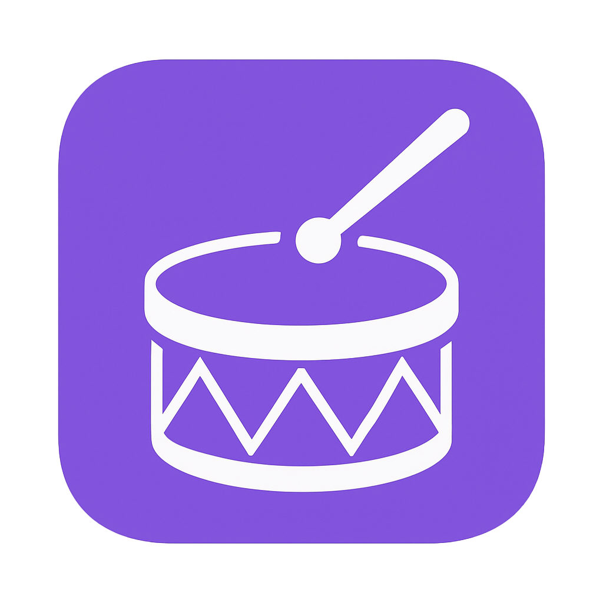

<!-- prettier-ignore -->
<div align="center">



# BeatSight

**See the music before you play it.**

[](https://github.com/rosacry/BeatSight/actions)
[](https://github.com/rosacry/BeatSight/actions)
[](https://codecov.io/gh/rosacry/BeatSight)
[](https://codecov.io/gh/rosacry/BeatSight)


[](LICENSE)

[Why BeatSight](#why-beatsight) • [Features](#features) • [Getting Started](#getting-started) • [Architecture](#architecture) • [Contributing](#contributing)

:dart: **Live at [beatsight.io](https://beatsight.io)** | :books: **[API Docs](https://api.beatsight.io/docs)**

</div>

---

## Why BeatSight?

Rhythm games like Guitar Hero, Rock Band, Dance Dance Revolution, and osu! all share one key mechanic: notes scroll toward a timing line *before* you need to hit them. This visual lookahead is what enables rapid skill acquisition—you see what's coming and your brain pre-plans the movement. But when drummers want to learn *real songs on real drums*, they're stuck memorizing by ear, rewinding the same 4-bar section dozens of times, or squinting at static sheet music that offers no timing guidance.

**This matters more than you might think.** Research on rhythm and motor learning ([Rhythm and Music-Based Interventions in Motor Rehabilitation](https://www.frontiersin.org/articles/10.3389/fnhum.2021.789467/full)) demonstrates that visual anticipation dramatically accelerates motor skill acquisition. When you can *see* what's coming, your brain pre-plans the movement instead of reacting after the fact. Drummers have never had this advantage—until now.

### The Problem We're Solving

**There's no universal place where drummers can find, create, share, and refine drum transcriptions for any song.** BeatSight is building that — the first global repository and community hub for drummers, similar to what osu! built for rhythm gaming.

### Why We're Different

| Capability | BeatSight | Learning Platforms (Melodics, Beatlii) | AI Transcribers (Klangio, etc.) |
|-----------|-----------|---------------------------------------|--------------------------------|
| **Drum Classes** | **21 classes** (snare center, rimshot, cross-stick, 5 hi-hat types, ride bow/bell, etc.) | Basic kit detection | 6-8 basic classes |
| **Training Data** | **14.6 million samples** | N/A (no AI) | Limited datasets |
| **Song Access** | **Any song** — AI transcription + community library | Curated lessons only | Any audio |
| **Technique Detection** | Ghost notes, flams, drags, rolls, velocity | Structured lessons | Limited or none |
| **Multi-hit Detection** | Simultaneous hits (kick+hi-hat, snare+crash) | N/A | Single hit per frame |
| **Cymbal Chokes** | ✅ Detected | ❌ Not detected | ❌ Not detected |
| **Acoustic Drum Support** | ✅ Visual lookahead works for all | ❌ Requires MIDI kit | N/A |
| **Community Library** | ✅ Anyone can contribute | ❌ Closed content | ❌ No community |
| **Community-Driven AI** | ✅ Training code open, corrections improve AI | ❌ Proprietary | ❌ No feedback loop |

BeatSight brings the rhythm game paradigm to drum practice:

- **Visual lookahead** — Notes scroll toward a timing line, giving you time to prepare each hit
- **Community library** — The first universal index for drum transcriptions: discover, share, and refine beatmaps for any song
- **Multiple creation paths** — Build maps from scratch, use AI-assisted transcription, or polish existing community maps
- **Professional-grade detection** — 21 drum classes including articulations, techniques, and dynamics
- **Tempo control** — Slow sections down to 50% without pitch shift, then gradually speed up as you learn
- **Stem isolation** — Practice with just the drum track, or hear how your part fits the full mix

The goal isn't gamification for its own sake—it's giving drummers the same visual-motor advantage that rhythm games have proven works, applied to learning *actual songs* on *real drums*, with a community-driven library that grows and improves over time.

## Features

### AI-Powered Transcription (Industry-Leading)
- **21 drum classes** — The most detailed detection anywhere: kick, snare (center/rimshot/cross-stick), hi-hat (5 types), ride (bow/bell), 3 toms, crash, china, splash, cymbal choke, and aux percussion
- **Technique detection** — Identifies flams, ghost notes, rolls, accents, and dynamics
- **Multi-hit detection** — Detects simultaneous hits (kick+hi-hat, snare+crash) unlike competitors
- **14.6M training samples** — Trained on the largest drum transcription dataset ever assembled

### Beatmap Creation
- **Manual editor** — Build beatmaps from scratch with a full-featured timeline editor
- **AI-assisted transcription** — Use machine learning to generate a starting point, then refine it
- **Community refinement** — Polish existing maps; your corrections feed back to improve the model
- **Automatic analysis** — Tempo, time signature, and velocity detection

### Multiple Practice Views
- **2D Lane View** — DDR/StepMania-style vertical scrolling with color-coded drum components
- **3D Highway** — Guitar Hero-inspired perspective with depth and scanline effects
- **Manuscript View** — Traditional drum notation with a **sweeping playhead highlighter** that glides left-to-right across the staff, its leading edge marking exactly when each note should be played

### Practice Tools
- Stem isolation (drums vs. full mix) via Demucs source separation
- Pitch-independent tempo adjustment (50%–200%)
- Section looping with visual loop markers
- Metronome overlay with configurable accents
- Progress tracking: favorites, tags, notes, and difficult section marking

### Platforms

| Platform | Description | Status |
|----------|-------------|--------|
| **Desktop** | Full-featured practice environment built on osu!-framework | :white_check_mark: Available |
| **Web** | Library management, uploads, AI job tracking at [beatsight.io](https://beatsight.io) | :white_check_mark: Live |
| **API** | RESTful API at [api.beatsight.io](https://api.beatsight.io/docs) | :white_check_mark: Live |
| **Mobile** | Flutter-based iOS/Android clients | :calendar: Planned |

> [!NOTE]
> Community beatmaps and manually-created maps are always free to access and play. AI-assisted transcription uses account credits and runs on secure cloud infrastructure (Modal)—manual creation is unlimited.

## Getting Started

### Prerequisites

| Tool | Version | Purpose |
|------|---------|---------|
| .NET SDK | 8.0+ | Desktop client |
| Python | 3.10+ | Backend services |
| Node.js | 20+ | Web frontend |
| FFmpeg | Latest | Audio processing |
| PostgreSQL | 15+ | Database |
| Redis | 7+ | Caching |

> [!TIP]
> See [`docs/SETUP.md`](docs/SETUP.md) for detailed platform-specific installation guides (Windows, macOS, Linux).

### Desktop Client

```bash
cd desktop/BeatSight.Desktop
dotnet restore
dotnet run
```

The desktop app connects to beatsight.io for AI transcription. Sign in with your account to use your credits or free tier quota.

<details>
<summary><strong>Backend API (for developers)</strong></summary>

```bash
cd backend
pip install -e ".[dev]"

# Start dependencies
docker compose up -d  # PostgreSQL + Redis

# Run migrations
alembic upgrade head

# Start server
uvicorn app.main:app --reload
```

API available at `http://localhost:8000`. Health check: `GET /health/live`. Interactive docs at `/docs`.

</details>

<details>
<summary><strong>Web Frontend (for developers)</strong></summary>

```bash
cd frontend
npm install
npm run dev
```

Opens at `http://localhost:5173` with hot module replacement.

</details>

## Pricing

**Playing and creating beatmaps is free.** AI-assisted transcription uses credits:

| Tier | Price | AI Transcriptions | Best For |
|------|-------|-------------------|----------|
| **Free** | $0 | 3/month | Getting started |
| **Pro** | $12/mo ($8/mo yearly) | 50/month | Regular creators |
| **Credits** | ~$0.33/song | Pay-as-you-go | Extra songs beyond quota |

Community maps, manual creation, verification, and all practice features are always free. Credits are only for AI-assisted transcription beyond your monthly quota.

## Architecture

```
BeatSight/
├── desktop/                  # osu-framework desktop client (C#/.NET 8)
│   ├── BeatSight.Desktop/    # Platform host & window management
│   ├── BeatSight.Game/       # Playback screens, editor, UI components
│   └── BeatSight.Tests/      # Unit tests (75 tests)
├── ai-pipeline/              # ML training & inference pipeline (Python)
│   ├── pipeline/             # Audio processing orchestration
│   ├── training/             # Model training scripts & configs
│   ├── transcription/        # Onset detection, drum classification
│   └── separation/           # Demucs source separation
├── backend/                  # FastAPI web services (Python)
│   └── app/                  # API routes, services, models (2895 tests, 84% coverage)
├── frontend/                 # React + TypeScript SPA (283 tests)
│   └── src/                  # Components, hooks, state management
├── docs/                     # Architecture, guides, specifications
├── data/                     # Dataset storage (gitignored)
└── shared/                   # Format specs, shared assets
```

### Tech Stack

| Component | Stack | Tests/Coverage |
|-----------|-------|----------------|
| Desktop | osu-framework, .NET 8, OpenGL | 75 tests |
| Backend | FastAPI, SQLAlchemy, PostgreSQL, Redis | 2895 tests, 84% cov |
| Frontend | React 18, TypeScript, TailwindCSS, Vite | 283 tests |
| AI Pipeline | PyTorch, Demucs, librosa | 195 tests |

### Infrastructure

| Service | Provider |
|---------|----------|
| Frontend Hosting | Cloudflare Pages |
| Backend Hosting | Railway |
| Database | Railway PostgreSQL |
| Cache | Railway Redis |
| AI Compute | Modal (GPU) |
| Storage | S3-compatible |
| Payments | Stripe |
| DNS/CDN | Cloudflare |

### Beatmap Format

BeatSight uses `.bsm` (BeatSight Map), a JSON-based format designed for version control and human readability:

```json
{
  "version": "1.0.0",
  "metadata": { "title": "Song Name", "artist": "Artist", "difficulty": 7.5 },
  "timing": { "bpm": 120.0, "offset": 0, "timeSignature": "4/4" },
  "hitObjects": [
    { "time": 1000, "component": "kick", "velocity": 0.85 },
    { "time": 1500, "component": "snare", "velocity": 0.92, "articulation": "ghost" }
  ]
}
```

See [`docs/BEATMAP_FORMAT.md`](docs/BEATMAP_FORMAT.md) for the full specification.

## Documentation

| Document | Description |
|----------|-------------|
| [`docs/SETUP.md`](docs/SETUP.md) | Platform-specific installation |
| [`docs/ARCHITECTURE.md`](docs/ARCHITECTURE.md) | System design deep-dive |
| [`docs/CONTRIBUTING.md`](docs/CONTRIBUTING.md) | Contribution guidelines |
| [`docs/BEATMAP_FORMAT.md`](docs/BEATMAP_FORMAT.md) | `.bsm` file format spec |
| [`docs/API_REFERENCE.md`](docs/API_REFERENCE.md) | Backend API documentation |
| [`docs/DESKTOP_DEVELOPER_GUIDE.md`](docs/DESKTOP_DEVELOPER_GUIDE.md) | Desktop client development |

## Contributing

Contributions are welcome! Please read [`docs/CONTRIBUTING.md`](docs/CONTRIBUTING.md) before submitting a PR.

### Why Contribute?

**You're helping build the first universal index for drum transcriptions.** Before BeatSight, there was no central place where drummers could find, create, share, and refine transcriptions for any song. By contributing beatmaps, verifying transcriptions, or improving the codebase, you're participating in building something that benefits drummers worldwide — similar to what osu! built for rhythm gaming.

**Every contribution matters:**
- 🥁 **Beatmap creators** — Add songs to the global index
- ✅ **Verifiers** — Ensure quality and earn karma
- 💻 **Developers** — Improve the platform for everyone
- 🔬 **AI corrections** — Your feedback trains better models

### Getting Started

1. Fork the repository
2. Create a feature branch: `git checkout -b feature/amazing-feature`
3. Make your changes and add tests
4. Run CI locally: `dotnet test BeatSight.sln` and `cd backend && pytest tests/`
5. Submit a pull request

> [!IMPORTANT]
> Beatmap contributions are what make BeatSight valuable—every refined map helps build the global drum transcription library. The AI training code in `ai-pipeline/training/` is provided for transparency; trained weights are proprietary but community corrections continuously improve the model.

## License

This project is licensed under the [MIT License](LICENSE).

## Support

- **Discord**: [Join our community](https://discord.gg/T57fDWcHDQ)
- **Issues**: [GitHub Issues](https://github.com/rosacry/BeatSight/issues)
- **Discussions**: [GitHub Discussions](https://github.com/rosacry/BeatSight/discussions)
- **Email**: [support@beatsight.io](mailto:support@beatsight.io)
