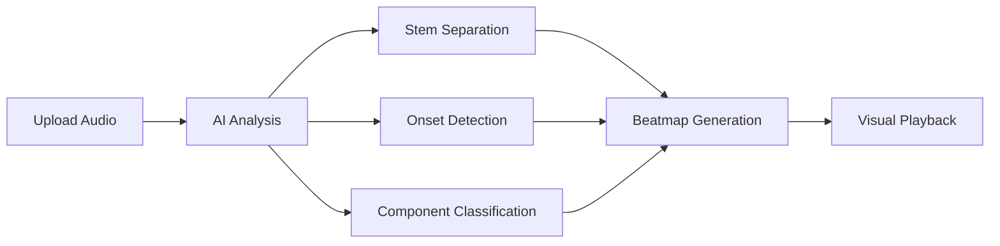

# Introduction to BeatSight

**BeatSight** is the first universal repository and community hub for drum transcriptions — combining AI-powered transcription with a global library built by drummers, for drummers.

## The Problem We're Solving

**There's no universal place where drummers can find, create, share, and refine drum transcriptions for any song.** BeatSight is changing that — building the global index for drummers, similar to what osu! built for rhythm gaming.

## What Makes BeatSight Different

### Industry-Leading AI (21 Drum Classes)

While competitors detect 6-8 basic drum classes, BeatSight distinguishes **21 classes** including:
- Snare articulations (center hit, rimshot, cross-stick)
- 5 hi-hat types (closed, open, pedal, splash, foot splash)
- Ride articulations (bow vs bell)
- Cymbal chokes (unique to BeatSight!)
- And more...

Our AI is trained on **14.6 million samples** — 30x more than competitors.

### Community-Built Global Library

- 🎵 **Discover** - Find beatmaps created and refined by the community
- 🤝 **Contribute** - Every map you create adds to the universal index
- ✅ **Verify** - Your corrections improve quality and train better AI
- 🏆 **Recognition** - Earn karma and climb leaderboards

## What BeatSight Does

- 🎵 **AI Transcription** - Upload any song and get detailed drum notation with technique detection
- 🥁 **Visual Playback** - Follow along with scrolling notation in 2D, 3D, or manuscript view
- 🎚️ **Practice Tools** - Speed adjustment, section looping, stem isolation, and metronome
- 🤝 **Community Refinement** - Verified users improve transcriptions over time

## Who Is It For?

### Drummers
- Learn songs by following visual notation
- Practice at slower speeds while maintaining pitch
- Focus on specific sections with A-B looping
- Isolate drum tracks with AI-powered stem separation

### Music Teachers
- Create practice materials for students
- Track student progress on specific songs
- Share custom beatmaps with corrections

### Transcribers & Contributors
- Use AI as a starting point for manual transcription
- Export to standard notation formats
- Contribute corrections to improve the AI and help drummers worldwide
- Build the universal drum transcription library

## Quick Start

1. **[Install BeatSight](/docs/getting-started/installation)** - Download for Windows, macOS, or Linux
2. **[Upload Your First Song](/docs/getting-started/first-transcription)** - Get AI-generated notation
3. **[Practice Mode](/docs/getting-started/practice-mode)** - Learn to use the playback controls

## How It Works

1. **Audio Upload** - Supports MP3, WAV, FLAC, and more
2. **AI Processing** - Our ML pipeline analyzes the audio
3. **Stem Separation** - Isolates drums from other instruments
4. **Transcription** - Detects onsets and classifies drum components
5. **Beatmap Output** - Generates a `.bs` beatmap file
6. **Playback** - Visual notation synced with audio

## Key Features

| Feature | Description |
|---------|-------------|
| **21 Drum Classes** | The most detailed detection: kick, snare (3 articulations), hi-hat (5 types), ride (bow/bell), toms, cymbals, and more |
| **Technique Detection** | Flams, rolls, ghost notes, accents — not just what notes, but *how* they're played |
| **Multi-Hit Detection** | Simultaneous hits (kick+hi-hat, snare+crash) unlike competitors |
| **14.6M Training Samples** | Trained on the largest drum transcription dataset ever assembled |
| **Speed Control** | 50% to 200% without pitch change |
| **Multiple Views** | 2D lanes, 3D highway, traditional notation |
| **Cloud Sync** | Access your library from any device |
| **Community Library** | The first universal index for drum transcriptions |

## Why Contribute?

You're not just using BeatSight — you're building something that didn't exist before. Every beatmap you create, verify, or refine adds to a **global resource for drummers worldwide**. Your corrections also help train better AI models, making future transcriptions more accurate for everyone.

## Community

- **[Discord](https://discord.gg/beatsight)** - Chat with other drummers
- **[GitHub](https://github.com/rosacry/BeatSight)** - Report issues, contribute code
- **[Blog](/blog)** - Updates and tutorials

## Support

Need help? Check our [FAQ](/docs/faq) or ask in [Discord](https://discord.gg/beatsight).
