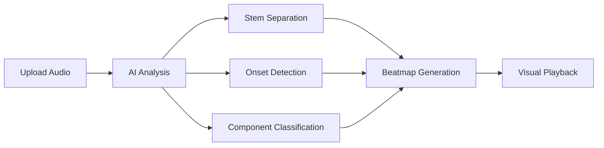

# Introduction to BeatSight

**BeatSight** is an AI-powered drum transcription platform that transforms any song into visual drum notation for practice and learning.

## What BeatSight Does

- 🎵 **AI Transcription** - Upload any song and get accurate drum notation in seconds
- 🥁 **Visual Playback** - Follow along with scrolling notation in 2D, 3D, or manuscript view
- 🎚️ **Practice Tools** - Speed adjustment, section looping, stem isolation, and metronome
- 🤝 **Community Corrections** - Verified users improve transcriptions over time

## Who Is It For?

### Drummers
- Learn songs by following visual notation
- Practice at slower speeds while maintaining pitch
- Focus on specific sections with A-B looping
- Isolate drum tracks with AI-powered stem separation

### Music Teachers
- Create practice materials for students
- Track student progress on specific songs
- Share custom beatmaps with corrections

### Transcribers
- Use AI as a starting point for manual transcription
- Export to standard notation formats
- Contribute corrections to improve the AI

## Quick Start

1. **[Install BeatSight](/docs/getting-started/installation)** - Download for Windows, macOS, or Linux
2. **[Upload Your First Song](/docs/getting-started/first-transcription)** - Get AI-generated notation
3. **[Practice Mode](/docs/getting-started/practice-mode)** - Learn to use the playback controls

## How It Works

1. **Audio Upload** - Supports MP3, WAV, FLAC, and more
2. **AI Processing** - Our ML pipeline analyzes the audio
3. **Stem Separation** - Isolates drums from other instruments
4. **Transcription** - Detects onsets and classifies drum components
5. **Beatmap Output** - Generates a `.bs` beatmap file
6. **Playback** - Visual notation synced with audio

## Key Features

| Feature | Description |
|---------|-------------|
| **21 Drum Components** | Kick, snare, hi-hat, toms, cymbals, and more |
| **Technique Detection** | Flams, rolls, ghost notes, accents |
| **Speed Control** | 50% to 200% without pitch change |
| **Multiple Views** | 2D lanes, 3D highway, traditional notation |
| **Cloud Sync** | Access your library from any device |
| **Offline Mode** | Practice without internet connection |

## Community

- **[Discord](https://discord.gg/beatsight)** - Chat with other drummers
- **[GitHub](https://github.com/rosacry/BeatSight)** - Report issues, contribute code
- **[Blog](/blog)** - Updates and tutorials

## Support

Need help? Check our [FAQ](/docs/faq) or ask in [Discord](https://discord.gg/beatsight).
