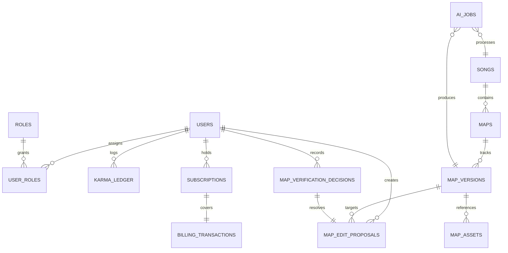

# BeatSight Web Backend Schema (Draft)

_Last updated: 2025-11-12_

## 1. Entity Diagram (Logical)

## 2. Tables & Key Fields

### 2.1 `users`
- `id` (UUID, PK)
- `display_name`
- `email`
- `email_verified` (bool)
- `phone_number`
- `phone_verified` (bool)
- `auth_provider_id`
- `karma_score` (int, default 0)
- `created_at`, `updated_at`

### 2.2 `roles`
- `id` (serial, PK)
- `code` (text, unique, e.g., `fixer`, `verifier`, `curator`, `admin`)
- `min_karma` (int)
- `requires_phone_verification` (bool)

### 2.3 `user_roles`
- `user_id` (FK → users.id)
- `role_id` (FK → roles.id)
- `assigned_at`
- Composite PK (`user_id`, `role_id`)

### 2.4 `karma_ledger`
- `id` (UUID, PK)
- `user_id` (FK → users.id)
- `delta` (int, +/−)
- `reason_code` (enum: `fix_accepted`, `fix_rejected`, `verification_complete`, etc.)
- `related_entity_type` (enum: `map`, `proposal`, `decision`, `subscription`)
- `related_entity_id`
- `recorded_at`

### 2.5 `songs`
- `id` (UUID, PK)
- `fingerprint_hash` (char(64), unique)
- `title`
- `artist`
- `bpm`
- `status` (enum: `pending`, `unverified`, `verified`, `archived`)
- `canonical_map_id` (FK → maps.id, nullable)
- `created_by` (FK → users.id, nullable)
- `created_at`, `updated_at`

### 2.6 `maps`
- `id` (UUID, PK)
- `song_id` (FK → songs.id)
- `difficulty_label` (text, e.g., `Expert`, `Intermediate`)
- `is_canonical` (bool) — only one per song set to true
- `state` (enum: `verified`, `unverified`, `archived`)
- `current_version_id` (FK → map_versions.id)
- `created_at`, `updated_at`

### 2.7 `map_versions`
- `id` (UUID, PK)
- `map_id` (FK → maps.id)
- `version_number` (int, monotonic per map)
- `source_type` (enum: `ai`, `manual`, `edit`)
- `generation_job_id` (FK → ai_jobs.id, nullable)
- `storage_uri` (text) — location of `.bsm`
- `stem_uri` (text, optional) — drum stem
- `diff_summary` (JSONB) — aggregated note/timing changes vs previous version
- `created_by` (FK → users.id, nullable for AI)
- `created_at`

### 2.8 `map_assets`
- `id` (UUID, PK)
- `map_version_id` (FK → map_versions.id)
- `asset_type` (enum: `waveform`, `preview_audio`, `thumbnail`)
- `storage_uri`
- `created_at`

### 2.9 `map_edit_proposals`
- `id` (UUID, PK)
- `map_version_id` (FK → map_versions.id)
- `proposer_id` (FK → users.id)
- `summary` (text)
- `diff_payload` (JSONB; structured patch)
- `status` (enum: `pending`, `approved`, `rejected`, `withdrawn`)
- `submitted_at`, `updated_at`

### 2.10 `map_verification_decisions`
- `id` (UUID, PK)
- `proposal_id` (FK → map_edit_proposals.id, unique)
- `verifier_id` (FK → users.id)
- `decision` (enum: `approve`, `reject`, `needs_changes`)
- `notes` (text)
- `decided_at`

### 2.11 `ai_jobs`
- `id` (UUID, PK)
- `song_id` (FK → songs.id)
- `requested_by` (FK → users.id, nullable for server-triggered)
- `state` (enum: `queued`, `processing`, `complete`, `failed`, `cancelled`)
- `priority` (enum: `standard`, `priority`)
- `error_message`
- `started_at`, `finished_at`, `created_at`

### 2.12 `subscriptions`
- `id` (UUID, PK)
- `user_id` (FK → users.id)
- `plan_code` (enum: `free`, `pro_monthly`, `pro_yearly`)
- `status` (enum: `active`, `past_due`, `cancelled`)
- `current_period_start`, `current_period_end`
- `ai_quota_remaining` (int)
- `last_synced_at`

### 2.13 `billing_transactions`
- `id` (UUID, PK)
- `subscription_id` (FK → subscriptions.id, nullable)
- `user_id` (FK → users.id)
- `provider` (enum: `stripe`)
- `provider_ref`
- `amount_cents`
- `currency`
- `type` (enum: `subscription`, `bundle_purchase`, `donation`)
- `status` (enum: `succeeded`, `pending`, `failed`, `refunded`)
- `processed_at`

## 3. Indexing & Queries
- `songs(fingerprint_hash)` unique index for quick lookup.
- `maps(song_id, difficulty_label)` partial index where `state = 'verified'`.
- `map_versions(map_id, version_number)` unique composite index.
- `map_edit_proposals(status)` btree to filter pending review queue.
- `ai_jobs(state, priority)` index for worker polling.
- `karma_ledger(user_id, recorded_at)` covering index for history queries.

## 4. Data Retention & Lifecycle
- Unverified `map_versions` and associated `map_assets` older than 60 days auto-archived unless pending proposal exists.
- `ai_jobs` records retained 180 days for audit; older entries trimmed after anonymizing references.
- `karma_ledger` retained indefinitely for accountability; aggregated karma stored in `users.karma_score` for quick access.

## 5. Open Questions
- Should we normalize difficulty tiers into separate table (`map_difficulties`) for future expansions (e.g., modifiers)?
- Do we store user-provided audio beyond fingerprints (e.g., for verification playback) and how long?
- Need decision on soft-delete vs hard-delete for users and maps (GDPR compliance).
- Evaluate storing diff payloads as JSON Patch vs domain-specific schema for performance.
