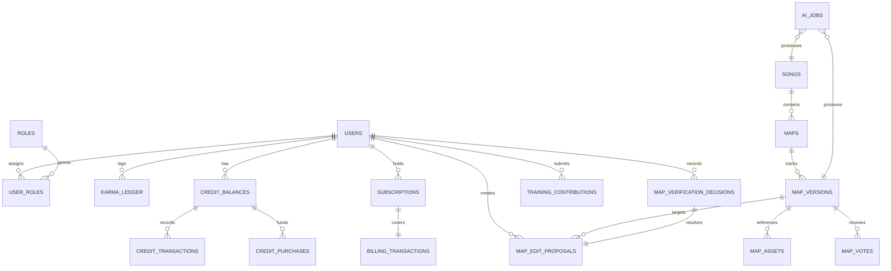

# BeatSight Web Backend Schema (Draft)

_Last updated: 2025-12-03_

## 1. Entity Diagram (Logical)

```mermaid
erDiagram
    USERS ||--o{ USER_ROLES : assigns
    USERS ||--o{ KARMA_LEDGER : logs
    USERS ||--o{ SUBSCRIPTIONS : holds
    USERS ||--o{ MAP_EDIT_PROPOSALS : creates
    USERS ||--o{ MAP_VERIFICATION_DECISIONS : records
    USERS ||--o{ CREDIT_BALANCES : has
    USERS ||--o{ TRAINING_CONTRIBUTIONS : submits

    ROLES ||--o{ USER_ROLES : grants

    SONGS ||--o{ MAPS : contains
    MAPS ||--o{ MAP_VERSIONS : tracks
    MAP_VERSIONS ||--o{ MAP_EDIT_PROPOSALS : targets
    MAP_VERSIONS ||--o{ MAP_VOTES : receives

    MAP_VERSIONS ||--o{ MAP_ASSETS : references

    AI_JOBS }o--|| SONGS : processes
    AI_JOBS }o--|| MAP_VERSIONS : produces

    MAP_VERIFICATION_DECISIONS ||--|| MAP_EDIT_PROPOSALS : resolves

    SUBSCRIPTIONS ||--|| BILLING_TRANSACTIONS : covers
    
    CREDIT_BALANCES ||--o{ CREDIT_PURCHASES : funds
    CREDIT_BALANCES ||--o{ CREDIT_TRANSACTIONS : records
```

## 2. Tables & Key Fields

### 2.1 `users`
- `id` (UUID, PK)
- `display_name`
- `email`
- `email_verified` (bool)
- `phone_number`
- `phone_verified` (bool)
- `auth_provider_id`
- `karma_score` (int, default 0)
- `created_at`, `updated_at`

### 2.2 `roles`
- `id` (serial, PK)
- `code` (text, unique, e.g., `fixer`, `verifier`, `curator`, `admin`)
- `min_karma` (int)
- `requires_phone_verification` (bool)

### 2.3 `user_roles`
- `user_id` (FK → users.id)
- `role_id` (FK → roles.id)
- `assigned_at`
- Composite PK (`user_id`, `role_id`)

### 2.4 `karma_ledger`
- `id` (UUID, PK)
- `user_id` (FK → users.id)
- `delta` (int, +/−)
- `reason_code` (enum: `fix_accepted`, `fix_rejected`, `verification_complete`, etc.)
- `related_entity_type` (enum: `map`, `proposal`, `decision`, `subscription`)
- `related_entity_id`
- `recorded_at`

### 2.5 `songs`
- `id` (UUID, PK)
- `fingerprint_hash` (char(64), unique)
- `title`
- `artist`
- `bpm`
- `status` (enum: `pending`, `unverified`, `verified`, `archived`)
- `canonical_map_id` (FK → maps.id, nullable)
- `created_by` (FK → users.id, nullable)
- `created_at`, `updated_at`

### 2.6 `maps`
- `id` (UUID, PK)
- `song_id` (FK → songs.id)
- `difficulty_label` (text, e.g., `Expert`, `Intermediate`)
- `is_canonical` (bool) — only one per song set to true
- `state` (enum: `verified`, `unverified`, `archived`)
- `current_version_id` (FK → map_versions.id)
- `created_at`, `updated_at`

### 2.7 `map_versions`
- `id` (UUID, PK)
- `map_id` (FK → maps.id)
- `version_number` (int, monotonic per map)
- `source_type` (enum: `ai`, `manual`, `edit`)
- `generation_job_id` (FK → ai_jobs.id, nullable)
- `storage_uri` (text) — location of `.bsm`
- `stem_uri` (text, optional) — drum stem
- `diff_summary` (JSONB) — aggregated note/timing changes vs previous version
- `created_by` (FK → users.id, nullable for AI)
- `created_at`

### 2.8 `map_assets`
- `id` (UUID, PK)
- `map_version_id` (FK → map_versions.id)
- `asset_type` (enum: `waveform`, `preview_audio`, `thumbnail`)
- `storage_uri`
- `created_at`

### 2.9 `map_edit_proposals`
- `id` (UUID, PK)
- `map_version_id` (FK → map_versions.id)
- `proposer_id` (FK → users.id)
- `summary` (text)
- `diff_payload` (JSONB; structured patch)
- `status` (enum: `pending`, `approved`, `rejected`, `withdrawn`)
- `submitted_at`, `updated_at`

### 2.10 `map_verification_decisions`
- `id` (UUID, PK)
- `proposal_id` (FK → map_edit_proposals.id, unique)
- `verifier_id` (FK → users.id)
- `decision` (enum: `approve`, `reject`, `needs_changes`)
- `notes` (text)
- `decided_at`

### 2.11 `ai_jobs`
- `id` (UUID, PK)
- `song_id` (FK → songs.id)
- `requested_by` (FK → users.id, nullable for server-triggered)
- `state` (enum: `queued`, `processing`, `complete`, `failed`, `cancelled`)
- `priority` (enum: `standard`, `priority`)
- `error_message`
- `started_at`, `finished_at`, `created_at`

### 2.12 `subscriptions`
- `id` (UUID, PK)
- `user_id` (FK → users.id)
- `plan_code` (enum: `free`, `pro_monthly`, `pro_yearly`)
- `status` (enum: `active`, `past_due`, `cancelled`)
- `current_period_start`, `current_period_end`
- `ai_quota_remaining` (int)
- `last_synced_at`

### 2.13 `billing_transactions`
- `id` (UUID, PK)
- `subscription_id` (FK → subscriptions.id, nullable)
- `user_id` (FK → users.id)
- `provider` (enum: `stripe`)
- `provider_ref`
- `amount_cents`
- `currency`
- `type` (enum: `subscription`, `bundle_purchase`, `donation`)
- `status` (enum: `succeeded`, `pending`, `failed`, `refunded`)
- `processed_at`

## 3. Additional Tables (Added Dec 2025)

### 3.1 Credit System Tables

#### `credit_balances`
- `id` (UUID, PK)
- `user_id` (FK → users.id, unique)
- `balance` (int, default 0)
- `auto_topup_enabled` (bool, default false)
- `auto_topup_pack` (enum: `starter`, `value`, `power`, nullable)
- `auto_topup_threshold` (int, default 0)
- `created_at`, `updated_at`

#### `credit_purchases`
- `id` (UUID, PK)
- `user_id` (FK → users.id)
- `pack_type` (enum: `starter`, `value`, `power`)
- `credits_amount` (int)
- `price_cents` (int)
- `stripe_payment_intent_id` (text, nullable)
- `status` (enum: `pending`, `completed`, `failed`, `refunded`)
- `created_at`

#### `credit_transactions`
- `id` (UUID, PK)
- `user_id` (FK → users.id)
- `amount` (int, +/−)
- `transaction_type` (enum: `purchase`, `consumption`, `refund`, `bonus`, `manual_adjustment`)
- `ai_job_id` (FK → ai_jobs.id, nullable)
- `description` (text)
- `created_at`

### 3.2 Training Contribution Tables

#### `training_contributions`
- `id` (UUID, PK)
- `user_id` (FK → users.id)
- `song_id` (FK → songs.id)
- `contribution_type` (enum: `onset_correction`, `component_relabel`, `timing_adjustment`)
- `component_name` (text)
- `original_time_ms` (float)
- `corrected_time_ms` (float, nullable)
- `confidence` (float)
- `status` (enum: `pending`, `approved`, `rejected`)
- `reviewer_id` (FK → users.id, nullable)
- `review_notes` (text, nullable)
- `created_at`, `reviewed_at`

#### `contribution_consents`
- `id` (UUID, PK)
- `user_id` (FK → users.id, unique)
- `allows_training_data` (bool, default false)
- `allows_public_credit` (bool, default false)
- `consented_at`, `updated_at`

#### `contribution_batch_impacts`
- `id` (UUID, PK)
- `batch_id` (text, unique)
- `contributions_count` (int)
- `baseline_f1` (float)
- `post_training_f1` (float)
- `improvement_percent` (float)
- `per_class_improvements` (JSONB)
- `created_at`

### 3.3 Sync Tables

#### `sync_clients`
- `id` (UUID, PK)
- `user_id` (FK → users.id)
- `device_name` (text)
- `device_type` (enum: `desktop`, `web`, `mobile`)
- `last_sync_at`
- `created_at`

#### `sync_logs`
- `id` (UUID, PK)
- `client_id` (FK → sync_clients.id)
- `sync_type` (enum: `full`, `delta`)
- `items_uploaded` (int)
- `items_downloaded` (int)
- `started_at`, `completed_at`

### 3.4 Voting Table

#### `map_votes`
- `id` (UUID, PK)
- `map_version_id` (FK → map_versions.id)
- `user_id` (FK → users.id)
- `vote_type` (enum: `upvote`, `downvote`)
- `created_at`
- Unique constraint: (`map_version_id`, `user_id`)

### 3.5 Push Subscriptions

#### `push_subscriptions`
- `id` (UUID, PK)
- `user_id` (FK → users.id)
- `endpoint` (text)
- `p256dh_key` (text)
- `auth_key` (text)
- `created_at`, `updated_at`

## 4. Indexing & Queries
- `songs(fingerprint_hash)` unique index for quick lookup.
- `maps(song_id, difficulty_label)` partial index where `state = 'verified'`.
- `map_versions(map_id, version_number)` unique composite index.
- `map_edit_proposals(status)` btree to filter pending review queue.
- `ai_jobs(state, priority)` index for worker polling.
- `karma_ledger(user_id, recorded_at)` covering index for history queries.

## 4. Data Retention & Lifecycle
- Unverified `map_versions` and associated `map_assets` older than 60 days auto-archived unless pending proposal exists.
- `ai_jobs` records retained 180 days for audit; older entries trimmed after anonymizing references.
- `karma_ledger` retained indefinitely for accountability; aggregated karma stored in `users.karma_score` for quick access.

## 5. Open Questions
- Should we normalize difficulty tiers into separate table (`map_difficulties`) for future expansions (e.g., modifiers)?
- Do we store user-provided audio beyond fingerprints (e.g., for verification playback) and how long?
- Need decision on soft-delete vs hard-delete for users and maps (GDPR compliance).
- Evaluate storing diff payloads as JSON Patch vs domain-specific schema for performance.
